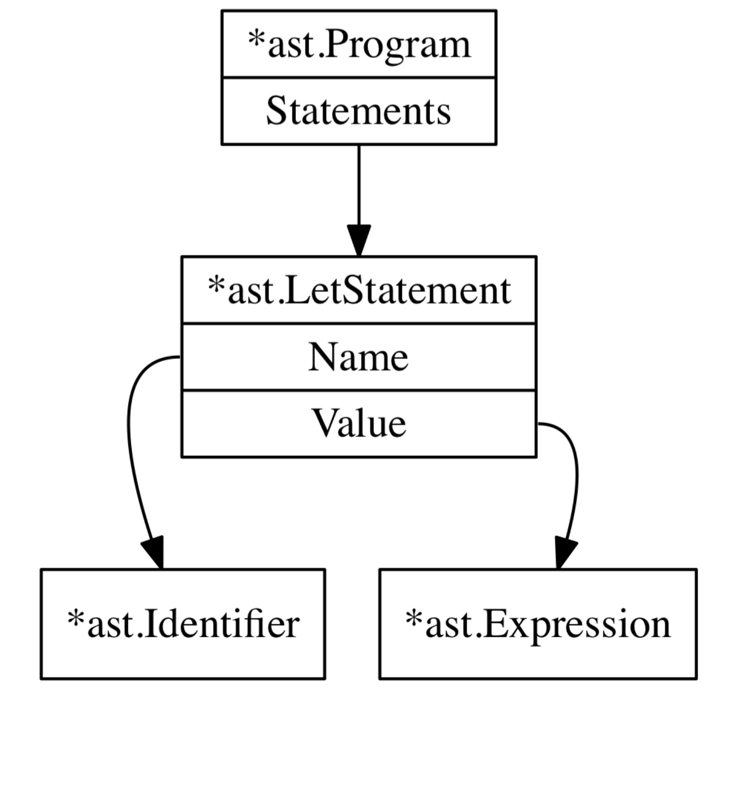

# [Writing An Interpreter In Go](https://interpreterbook.com/)
by Thorsten Ball: [GitHub](https://github.com/mrnugget) || [Twitter](https://twitter.com/thorstenball)
⭐⭐⭐⭐⭐

- sample code from this excellent book series
- the [first book](https://interpreterbook.com/) tackles interpreters for the demo Monkey programing language; the [follow-up book](https://compilerbook.com/) builds a compiler

_(Note: this repo was assembled using Go 1.18)_

* Chapter 1: [Lexing](lexer/lexer_test.go)
* Chapter 2: [Parsing](parser/parser.go)
* Chapter 3: [Evaluation](evaluator/evaluator.go)
* Chapter 4: [Data types & functions](ast/ast.go)

